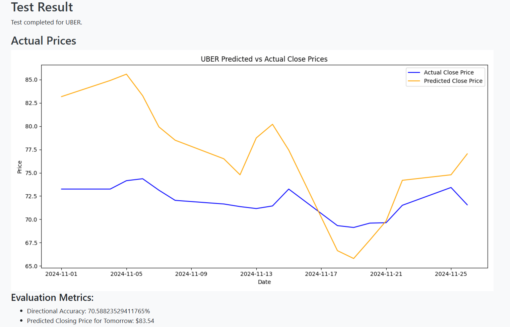

<h1>Stock Price Prediction Using News Sentiment Analysis </h1>

<h3>Overview</h3>
This project aims to predict stock prices by doing sentiment analysis on news articles.  We train machine learning models to forecast stock price movements based on sentiment scores derived from news content.

<h3>Introduction</h3>
Predicting stock prices is a complex task influenced by numerous factors, including market trends, economic indicators, and news events. News sentiment analysis provides valuable insights into the public and media perception of companies, which can significantly impact stock performance.

This project integrates news sentiment analysis with stock price prediction by:

1. Collecting news articles related to specific stocks.
2. Performing sentiment analysis on the news content.
3. Combining sentiment scores with historical stock data.
4. Training machine learning models to predict future stock prices.

<h3>Access the Application</h3>

1. Run app.py.
2. Open your web browser and navigate to http://localhost:5000

<h3>Using the Application</h3>

<h5>Train a Model:</h5> Navigate to the "Train Model" page, upload your dataset or choose to use the data in the 'data' folder, specify a model name to save the model, and start training.
<h5>Test a Model:</h5> Go to the "Test Model" page, select a pre-trained model, upload test data or use default data, adjust the sequence length if necessary, and run the test.
<h5>View Results:</h5> After testing, view graphs of predicted vs. actual stock prices and evaluation metrics.

<h3>Data</h3>
<h5>All-the-News-2 Dataset</h5>
We utilized the All-the-News-2 dataset, which contains millions of news articles from 2016 to 2020. This dataset provides a rich source of historical news data for model training. 
https://components.one/datasets/all-the-news-2-news-articles-dataset

<h5>NewsAPI.org Data</h5>
To include more recent news articles, we fetched data from NewsAPI.org. This allowed us to enhance the model's ability to predict current stock price movements based on up-to-date news sentiment. 
https://newsapi.org

<h3>Pre-trained Models</h3>
Several pre-trained models are included in this project:

* all_model: Trained on 10 stocks from the All-the-News-2 dataset.
* tech_5_model: Trained on 5 technology stocks from the same dataset.
* Single Stock Models: Four models each trained on data from a single stock.
* Recent News Model: Trained with newer data pulled from NewsAPI.org.
These models can be used out-of-the-box to make predictions.

<h3>Getting More Data</h3>
Please use the tools provided in 'data preprocessing helpers' to gather and process more data.  The 'Data Preprocessing Tools' file in this folder contains info about each of the included tools.  Start with these:

* get_news_api_data.py
* get_csv_data.py

<h3>Project Structure</h3>
<strong>app.py:</strong> Main Flask application file handling routes and requests. 
<strong>model_functions.py:</strong> Contains functions for data preparation, model training, and testing. 
<strong>templates/:</strong> HTML templates for rendering web pages. 
<strong>static/:</strong> Static files 
<strong>data/:</strong> Directory containing datasets and test data files. 
<strong>models/:</strong> Directory where trained models are saved. 
<stong>data_preprocessing_helpers/:</strong> Tools for working with and preprocessing data. 
<strong>requirements.txt:</strong> Lists all Python packages required to run the project. 

<h3>Requirements</h3>
Ensure you have the following Python packages installed:

* flask
* numpy
* pandas
* yfinance
* scikit-learn
* tensorflow
* keras
* matplotlib
* seaborn
* newsapi-python
* vaderSentiment
  
You can install these packages using the requirements.txt file

<h3>Acknowledgements</h3>
<h5>Datasets:</h5>
All-the-News-2 Dataset
NewsAPI.org
<h5>Sentiment Analysis Tool:</h5>
VADER Sentiment Analysis
<h3>License</h3>
This project is licensed under the MIT License. See the LICENSE file for details.